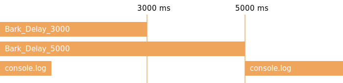

## 什麼是 Promise

> **Promise**專門用來處理異步問題，像是某人承諾幫你完成某件事情
> 在他完成之前你可以繼續處理自己手邊的工作，當然你也可以選擇等他回來再繼續

## 在開始之前

先來看看在沒有 `Promise` 之前
是怎麼處理異步問題的吧！~~痛過之後你才會懂得他的好~~
如果你非常熟 `CallBack Hell` ，你可以選擇跳過這段

下面這是一段很尋常的代碼

```js
const Bark = () => {
    console.log("汪汪")
}

Bark()
console.log("我會在汪汪後執行")
```

但如果 `Bark` 是一個異步方法，情況就不同了

```js
// Bark還是上面那個喔

const Bark_Delay = () => {
  setTimeout(() => {
    Bark()
  },1000)
}

Bark_Delay()
console.log("我會在汪汪後執行")
```

為了讓程式碼能正確執行
我們把叫完之後要做的事包成 `CallBack`
等異步方法做完時呼叫

```js
const Bark_Delay_Callback = callBack => {
    setTimeout(() => {
        Bark()
        callBack()
    },1000)
}

Bark_Delay_Callback(() => {
    console.log("我會在汪汪後執行")
})
```

如此程式碼就可以正常執行了
但是如果情況越來越複雜
程式碼會越來越複雜,可讀性也會越來越低
以常見 Ajax 的狀況來說
程式碼可能長得像下面這樣

```js
// 不用讀懂，我只是想讓你知道它長的很噁心

const getUserProfile = (account, password, callBack) => {
    checkAuth(account, password, auth => {
        if(!auth){
            return "權限錯誤"
        }
        fetchUserProfile(auth, (error,rawData) => {
            if(error){
                return error
            }
            parseUserProfile(rawData, (error,profile) => {
                if(error){
                    return error
                }
                // 第一個參數必須回傳 undefined
                // 表示沒有錯誤
                callBack(undefined,profile)
            })
        })
    })
}

getUserProfile("account", "password", (error,profile) => {
    if(error){
        console.error(error)
    }
    console.log("取得使用者資料成功")
})
```

是的，這個波動拳 (CallBack Hell) 是相當難維護的
為了解決如此窘境，Es6 加入了 Promise

## Promise 正式登場！

我們一邊改寫 Bark 代碼一邊說明吧

```js
const Bark_Delay_Promise = () => {
    return new Promise((resolve, reject) => {
        // 呼叫 resolve ，告知 Promise 事件完成時
        // 呼叫 reject ，告知 Promise 有錯誤發生完成時
        setTimeout(() => {
            Bark()
            resolve("這個字串會傳進 then 裡面的 value")
        },1000)
    })
}

Bark_Delay_Promise()
    .then(value => {
        // value = "這個字串會傳進 then 裡面的 value"
        console.log("我會在汪汪後執行")
        return "還可以繼續往下傳"
    })
    .then(value => {
        console.log(value)
    })
    .catch(error => {
        console.error("Oops！好像哪邊爆炸了！")
    })

console.log("Promise 是異步的，所以我是第一行")
```

Promise 在建構的時候必須傳入一個 CallBack
CallBack 會傳入兩個方法：

+ resolve
  完成時呼叫
  當 resolve 被呼叫會執行 `Promise.then`
+ reject
  出錯時呼叫
  當 reject 被呼叫會執行 `Promise.catch`

使用 Promise 最顯著的優點就是解決了 CallBack Hell的問題
CallBack 可以使用 Promise.then 不斷連，錯誤處理也變得更簡潔

剛剛上面那段很噁心的波動拳可以改成這樣

```js
const getUserProfile = (account,password,callBack) => {
    return checkAuth(account,password)
        .then(auth => {
            if(!auth){
                throw "權限錯誤"
            }
            else{
                return fetchUserProfile(auth)
            }
        })
        .then(rawData => {
            return parseUserProfile(rawData)
        })
}

getUserProfile("account", "password")
    .then(profile => {
        console.log("取得使用者資料成功")
    })
    .catch(error => {
        console.error(error)
    })
```

## 等待多個異步方法

你可以使用 `Promise.all` 來等待多個 Promise完成

### 執行流程



```js
const Bark_Delay_3000 = () => {
    return new Promise((res,rej) => {
        setTimeout(() => {
            Bark()
            res(new Date().toLocaleTimeString())
        },3000)
    })
}

const Bark_Delay_5000 = () => {
    return new Promise((res,rej) => {
        setTimeout(() => {
            Bark()
            res(new Date().toLocaleTimeString())
        },5000)
    })
}

var promises = [
    Bark_Delay_3000(),
    Bark_Delay_5000()
]

Promise.all(promises)
    .then(values => {
        console.log("--Promise.all--")
        console.log("Bark_Delay_3000:\t"+ values[0])
        console.log("Bark_Delay_5000:\t"+ values[1])
    })

console.log("前面都是異步，所以我會是第一行")
```

`Promise.all` 傳入一個 Promise Array，並回傳一個 Promise
當 Array 裡的 Promise 全部完成的時候，執行 Promise.then
Promise.then 會接到所有 Promise 回傳的值，他也是一個 Array

這麼一來就可以等待多個 Promise
可以執行複雜的異步的任務

## Async/Await

先來看一張流程圖吧


```js
Bark_Delay_3000()
    .then(value => {
        console.log("Bark_Delay_3000:\t" + value)
        return Promise.all([
                Bark_Delay_3000(),
                Bark_Delay_5000(),
            ])
    })
    .then(values => {
        console.log("--Promise.all--")
        console.log("Bark_Delay_3000:\t"+ values[0])
        console.log("Bark_Delay_5000:\t"+ values[1])
    })
console.log("Bark_Delay_3000 是異步的，所以我會是第一行")
```

如果以 Promise 的寫法
Promise 仍是不斷 then 下去，維護難度也跟著提高
也因為如此在 Es7 加入了`Async/Await`

```js
const Bark_Async_Await = async() => {
    var value = await Bark_Delay_3000()
    console.log("Bark_Delay_3000 :\t " + value)

    values = await Promise.all([
        Bark_Delay_3000(),
        Bark_Delay_5000()
    ])

    console.log("--Promise.all--")
    console.log("Bark_Delay_3000:\t"+ values[0])
    console.log("Bark_Delay_5000:\t"+ values[1])

}

Bark_Async_Await()
console.log("Bark_Async_Await 是異步的，所以我會是第一行")
```

這兩段程式碼是等價的
`await` 只能用在有 `async` 修飾的 Function
await 後面必須接上 Promise，會等待 Promise 執行完畢後直接回傳
免除了要寫在 Promise.then 的麻煩
如此程式碼就可以長得跟同步執行一模一樣
可讀性更高，也更容易維護