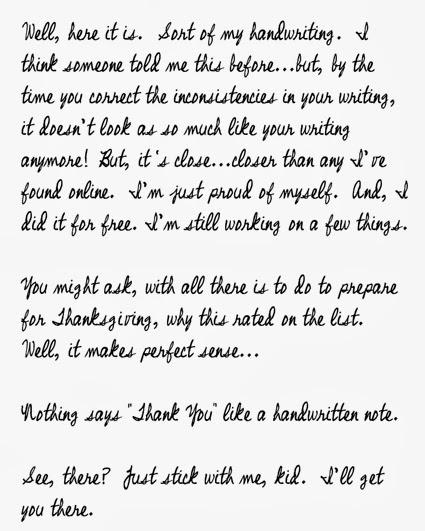
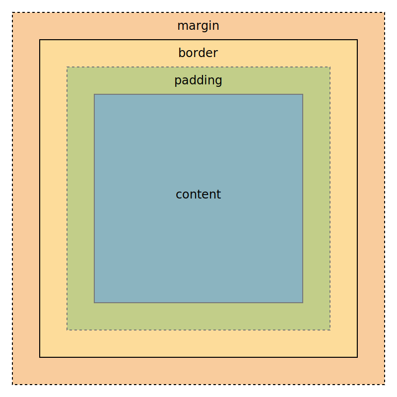

## Box Module

[範例連結](http://localhost:8080/demo/%E4%B8%89%E9%9A%BB%E5%B0%8F%E8%B1%AC%EF%BC%88%E4%B8%AD%E8%8B%B1%E5%B0%8D%E7%85%A7%EF%BC%89/)

前面有一提到，一個網站由兩種元素構成  
就如同一般在書寫一樣



+ 圖片、文字  
  這種元素被稱為 `inline` 元素  
  `inline` 預設的排版上  
  由左往右，如果文字超過段落寬度會換行  
  受到 `text-align` 與 `line-height` 控制

+ 標題、段落、區塊  
  這種元素被稱為 `block` 元素  
  `block` 在排版上為一塊一塊往下排序

在 CSS 以 `Box Module` 定義 `block` 元素，如下圖


+ Margin （邊界）︰  
  不包含在 `block` 內，為 `block` 間的距離

+ Border （邊框）︰  
  就是邊框，剛剛範例網站黑色的那個

+ Padding （邊距）︰  
  文字與邊框的距離

使用語法如下

+ Border︰

```css
p{
  border-width:1px;
  border-style:solid;
  border-color:black;

  /* 縮寫 */
  border:1px solid black;
}
```

+ Margin 、 Padding︰

```css
p{
  margin-top:1px;
  margin-right:2px;
  margin-bottom:3px;
  margin-left:4px;

  /* 縮寫 */

  /* 上 右 下 左 */
  margin:1px 2px 3px 4px;

  /* 上 左右 下 */
  margin:1px 2px 3px;

  /* 上下 左右*/
  margin:1px 2px;

  /* 全部*/
  margin:1px;
}
```

## 長、寬

在預設的狀況下  
設定 `width` 與 `height`  
會設定在 Content 之上  
但是如此並不直觀，一般認定 `Border + Padding + Content` 才是一個元素

為了避免複雜手動計算  
可以使用 `box-sizing`

```css
*{
  box-sizing:border-box;
}
```

## 單位

+ px︰  
  最基礎的單位是 `px` ，也就是像素  
  其餘的單位在顯示時，都會轉會成像素

+ em︰  
  字寬，會依照目前字寬決定大小  
  如目前字寬為 `16px`，那 `2em` 即為 `32px`  
  只要改變底層的`font-size`，`em`就會跟著一起縮放  
  這是最推薦使用的單位，避免使用 `px`

+ %︰  
  常用在設定長、寬  
  依據`父元素`決定  

+ vw、vh︰  
  瀏覽器大小  
  100vw 為 一個瀏覽器寬

## 置中語法

+ 是一個 block 元素（ inline 元素沒有寬高，受限於文字大小）
+ 有指定寬度

可以使用以下語法置中

```css
.center{
  margin-right:auto;
  margin-left:auto;
  width:20em;
}
```